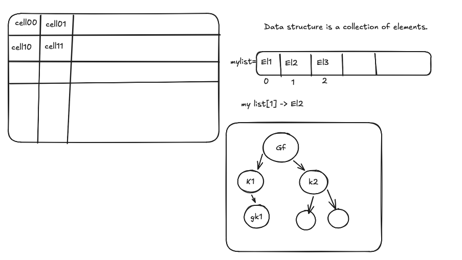

# Data structure in python

Data structure is a way of organizing and storing data in a computer so that it can be accessed and modified efficiently. Python provides several built-in data structures, including lists, tuples, sets, and dictionaries.

## Data structure divided into two categories:

**Linear data structure** and **Non-linear data structure**.

- Linear data structure is a type of data structure where the elements are arranged in a sequential manner.
- Non-linear data structure is a type of data structure where the elements are not arranged in a sequential manner.



## Type of data structure

1. List
2. Tuple
3. Set
4. Dictionary

## List

- A list is a collection of items/elements that are ordered and changeable. It allows duplicate members. Lists are defined by having values between square brackets `[]`.
- Lists are index based data structure, which means that the elements in a list can be accessed using their index. The index of the first element is 0, the index of the second element is 1, and so on.

  Ex. ```python
  my_list = [1, 2, 3, 4, 5]
  print(my_list) # Output: [1, 2, 3, 4, 5]

  print(my_list[0]) # Output: 1
  print(my_list[1]) # Output: 2
  print(my_list[2]) # Output: 3
  print(my_list[3]) # Output: 4
  print(my_list[4]) # Output: 5

  ```


  ```

## Set

- A set is a collection of items/elements that are unordered and unindexed. It does not allow duplicate members. Sets are defined by having values between curly braces `{}`.
  Ex. ```python
  my_set = {1, 2, 3, 4, 5}
  print(my_set) # Output: {1, 2, 3, 4, 5}

  ```

  ```

### Set operations

- Union: The union of two sets is a set that contains all the elements of both sets. It can be performed using the `|` operator or the `union()` method.
  Ex. ```python
  set1 = {1, 2, 3}
  set2 = {3, 4, 5}
  union_set = set1 | set2
  print(union_set) # Output: {1, 2, 3, 4, 5}

```

```

## Tuple

Tuple is a index based, immutable data structure.

```
 Ex. my_tuple = (1, "Hello", 4.5)
  my_tuple[0] -> 1
```

Tuple is widely in python to return multiple values from function.

## Dictionary (map)

Dictionary is a key - value pair data structure.
Key and value can be anything.
Key can be unique.

Maths : 89
Social: 56
English: 91

```
Ex. marks = {"Key": "Value",
     "Key2": "Value2",
     "key3": "Value3",
     "Key": "Value4"
   }
```
