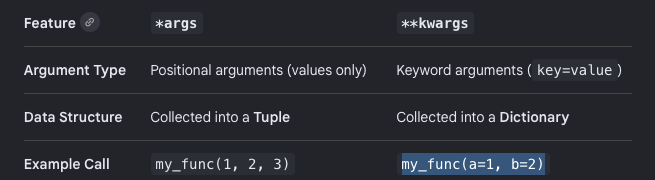

# Functions in Python

A function is a block of code that performs a specific task. It is a reusable piece of code that can be called multiple times in a program.
Functions are defined using the `def` keyword, followed by the function name and parentheses `()`. The code block within every function starts with a colon `:` and is indented.

```
syntax:
def function_name(parameters):
    # code block
```

```python
def greet(name):
    print(f"Hello, {name}!")

greet("Alice") # Output: Hello, Alice!
greet("Bob")   # Output: Hello, Bob!
```

Parameters are the variables that are defined in the function definition. They are used to pass values to the function when it is called. Parameters are optional, and a function can have zero or more parameters.

Function can return a value using the `return` statement. The `return` statement is used to exit a function and return a value to the caller.

```python
def add(a, b):
    return a + b

result = add(5, 3)
print(result) # Output: 8
```

## Function with \*args and \*\*kwargs

In Python, you can define functions that accept a variable number of arguments using `*args` and `**kwargs`.

