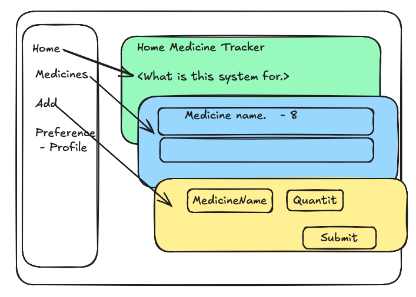

# Home Medicine Tracker

## Database approach

### InMemory.

We are going to maintain in a dictionary form.
Easy to implement, it is not permanently persistent.

### File storage.

We can use a file may be a CSV file, to store the data. It is easy to implement and persistent, but it is not scalable, write, read, update operations more critical.

### SQL Database.

We can use a SQL database to store the data. It is easy to implement and persistent.
For example. SQLite, Oracle, PostgreSQL, etc..

## UI Wireframe design

